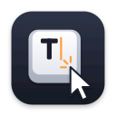

# ClickType




ClickType is a small macOS menu bar app that types the plain-text contents of your clipboard into the app you were using. Copy text, put the caret where you want it, and click the keycap icon in the menu bar. ClickType sends keyboard events character by character, which can help when ordinary paste is unavailable.

## Download and install

**Requires macOS 13 or later on Apple Silicon.** The current release is an `arm64` build.

1. Download [ClickType 1.0](https://github.com/QuackByte/clicktype/releases/latest) and extract `ClickType-1.0.0-macOS.zip`.
2. Move `ClickType.app` to your Applications folder and open it. The release is signed with a Developer ID certificate and notarized by Apple.
3. On first use, grant **Accessibility** access if macOS asks. You can also open **System Settings → Privacy & Security → Accessibility** and enable ClickType there. Restart ClickType if the permission does not take effect immediately.

Keep the app in Applications before turning on **Run at Login** so macOS can find it at the same path later.

## Use

1. Copy some text.
2. Place the caret in a text field in another app.
3. Left-click ClickType's keycap icon in the menu bar. ClickType returns to the previous app and types the clipboard text.

Right-click or Option-click the menu bar icon to open the menu. From there you can type the clipboard now, check or request Accessibility access, open Accessibility settings, turn Run at Login on or off, or quit. If macOS requires approval for Run at Login, follow the link in that menu to Login Items settings.

ClickType reads the clipboard when you ask it to type. It ignores images and other clipboard contents without plain text. Newlines are sent as Return and tabs as Tab.

## Privacy and limitations

- Clipboard text is held briefly in memory while ClickType types it. The app does not save the text, send it over a network, or include analytics.
- Accessibility permission is needed to send keyboard events to other apps. Grant it only if you are comfortable with that capability; the source code is available in [`Sources`](Sources).
- Some apps do not accept synthetic Unicode keyboard events. Secure or privileged fields may reject them. Typing long text takes time because characters are sent in sequence.
- The current build is distributed through GitHub Releases. Its Accessibility-based typing feature is incompatible with the sandbox required for Mac App Store apps.

## Build from source

Open [`ClickType.xcodeproj`](ClickType.xcodeproj) in Xcode and run the `ClickType` scheme. Xcode 15 or later is required. You can also build an unsigned local copy from Terminal:

```sh
xcodebuild -project ClickType.xcodeproj -scheme ClickType \
  -configuration Debug -derivedDataPath build/DerivedData \
  CODE_SIGNING_ALLOWED=NO build
```

The checked-in Xcode project is generated from [`project.yml`](project.yml) with XcodeGen. The app uses AppKit, SwiftUI, Core Graphics, and ServiceManagement, with no third-party runtime dependencies. Release signing is configured for bundle ID `dev.quackbyte.clicktype` and team `435MC3786D`; contributors can override signing settings for their own builds. Publishing a release requires Developer ID signing and Apple notarization.

## CI and releases

[GitHub Actions](.github/workflows/ci-release.yml) builds the app and runs unit tests on pull requests, pushes to `main`, and version tags. A tag such as `v1.0.1` starts the release job only after tests pass. It exports a Developer ID signed Apple Silicon app, notarizes and staples it, checks it with Gatekeeper, and uploads the ZIP and its SHA-256 checksum to GitHub Releases. The release notes include a changelog of commits since the previous version tag.

To publish a new version, first merge changes into `main`, then push a `vMAJOR.MINOR.PATCH` tag pointing to that commit. The workflow sets the app version from the tag and the build number from its GitHub Actions run number. Apple signing uses an App Store Connect API key stored as a GitHub Actions secret; no signing key is committed to this repository.

## License

ClickType is available under the [MIT License](LICENSE).
